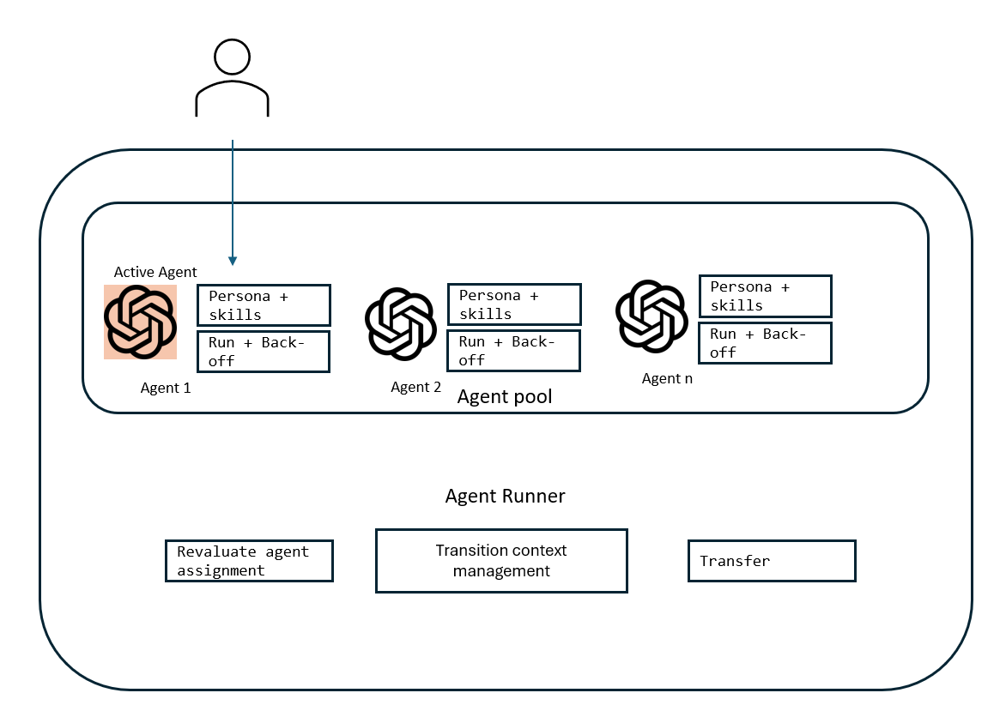
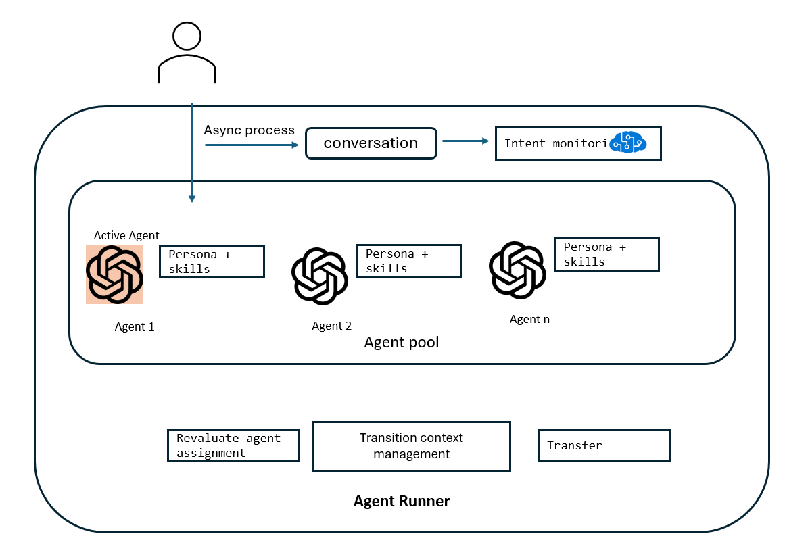

# Multi-modal & Multi-domain agent solution accelerator 
This repo contains examples of multi-domain design to enable scaling out to multiple domain.
There are two implementations, one is for text based commmunication, another is for voice based communication.
The common business scenario for both implementations are about flight and hotel booking customer service.
The goal is to automate customer service for a travel booking agency.
Customer service function helps registered customers make changes to their hotel and flight bookings, confirm the reservations and ask questions on hotel and flight policies.
There are two design patterns to help orchestrate multiple individual agents, one for hotel domain, another for flight domain, to work together behind the scene while appearing as a single customer service agent to the customer.
Check the link at each design pattern's implementation to access detail implementation and run the solutions.

### 1. Multi-Domain Agents Design 1

Multiple domain-specific agents are orchestrated by an Agent Runner to scale across multiple domains while appearing as a single agent to users. Users directly interact with one active agent at a time, without the agent being supervised. Each agent is instructed to back off automatically when the conversation goes out of scope.
Agent runner only intervene when back-off happens.

This pattern is implemented for [text_agent](text_agent/README.md) 

### 2. Multi-Domain Agents  Design 2

Multiple domain-specific agents are orchestrated by an Agent Runner to scale across multiple domains while appearing as a single agent to users. Users directly interact with one active agent at a time, while the conversation is supervised asynchronously by the Agent Runner. When the conversation goes out of scope, the Agent Runner intervenes and promotes the appropriate agent to take over the conversation

This pattern is implemented for [voice_agent](voice_agent/README.md) 
